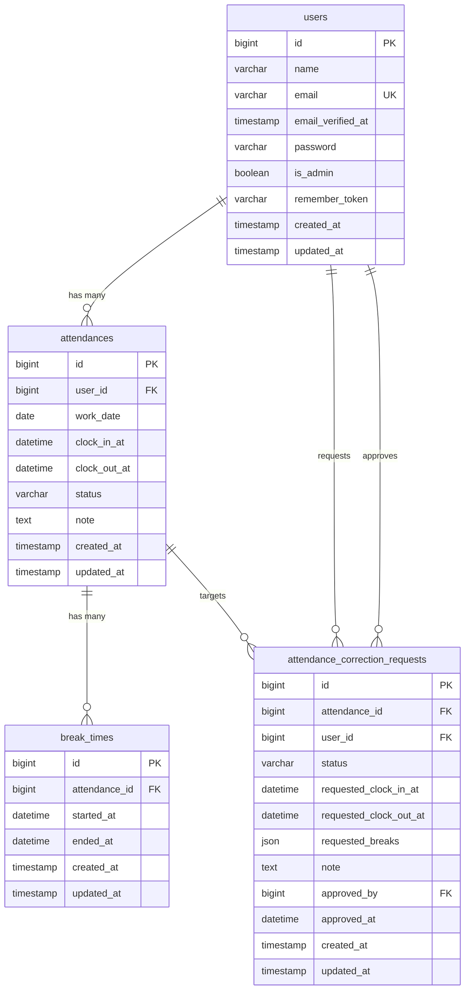

# 勤怠管理アプリ（Laravel）

Laravel 8 で構築された勤怠管理アプリです。  
Docker（Nginx / PHP-FPM / MySQL / phpMyAdmin / MailHog）でローカル実行でき、
一般ユーザーの打刻・勤怠修正申請と、管理者の承認・勤怠管理に対応しています。

## 主な機能

### 一般ユーザー
- 会員登録 / ログイン
- メール認証（MailHogで認証メール確認）
- 出勤 / 休憩開始 / 休憩終了 / 退勤
- 日別勤怠一覧・詳細確認
- 勤怠修正申請

### 管理者
- 管理者ログイン
- 日次勤怠一覧・詳細更新
- スタッフ一覧
- スタッフ別月次勤怠の確認
- 勤怠修正申請の承認

## 技術スタック
- PHP 8 系（Laravel 8.75）
- MySQL 8.0
- Nginx 1.21
- Docker / Docker Compose
- MailHog

## 環境構築方法

### 1. リポジトリ直下でコンテナ起動
```bash
docker compose up -d --build
```

### 2. PHP コンテナに入る
```bash
docker compose exec php bash
```

### 3. アプリ初期設定（`/var/www` で実行）
```bash
cp .env.example .env
composer install
php artisan key:generate
php artisan migrate --seed
```

### 4. アクセス先
- アプリ: http://localhost
- phpMyAdmin: http://localhost:8080
- MailHog: http://localhost:8025

## MailHog について
MailHogはローカル開発向けのメールキャプチャツールです。  
本アプリでは会員登録後のメール認証通知を MailHog で受信し、メール本文内の認証リンクから認証を完了できます。

- SMTP受信ポート: `1025`
- Web UI: `http://localhost:8025`
- `.env` 既定値: `MAIL_HOST=mailhog`, `MAIL_PORT=1025`, `MAILHOG_WEB_URL=http://localhost:8025`

## テストアカウント情報
`php artisan db:seed` 実行後に、以下の検証用アカウントが利用できます。

### 一般ユーザー
- メールアドレス: `user@example.com`
- パスワード: `password`

### 管理者ユーザー
- メールアドレス: `admin@example.com`
- パスワード: `password`

## テーブル仕様

### usersテーブル
| カラム名 | 型 | primary key | unique key | not null | foreign key |
| --- | --- | --- | --- | --- | --- |
| id | bigint | ◯ |  | ◯ |  |
| name | varchar(255) |  |  | ◯ |  |
| email | varchar(255) |  | ◯ | ◯ |  |
| email_verified_at | timestamp |  |  |  |  |
| password | varchar(255) |  |  | ◯ |  |
| is_admin | tinyint(1) |  |  | ◯ |  |
| remember_token | varchar(100) |  |  |  |  |
| created_at | timestamp |  |  |  |  |
| updated_at | timestamp |  |  |  |  |

### attendancesテーブル
| カラム名 | 型 | primary key | unique key | not null | foreign key |
| --- | --- | --- | --- | --- | --- |
| id | bigint | ◯ |  | ◯ |  |
| user_id | bigint |  |  | ◯ | users.id |
| work_date | date |  | （複合） | ◯ |  |
| clock_in_at | datetime |  |  |  |  |
| clock_out_at | datetime |  |  |  |  |
| status | varchar(255) |  |  | ◯ |  |
| note | text |  |  |  |  |
| created_at | timestamp |  |  |  |  |
| updated_at | timestamp |  |  |  |  |

> ※ `attendances` は `user_id + work_date` の複合ユニーク制約あり

### break_timesテーブル
| カラム名 | 型 | primary key | unique key | not null | foreign key |
| --- | --- | --- | --- | --- | --- |
| id | bigint | ◯ |  | ◯ |  |
| attendance_id | bigint |  |  | ◯ | attendances.id |
| started_at | datetime |  |  | ◯ |  |
| ended_at | datetime |  |  |  |  |
| created_at | timestamp |  |  |  |  |
| updated_at | timestamp |  |  |  |  |

### attendance_correction_requestsテーブル
| カラム名 | 型 | primary key | unique key | not null | foreign key |
| --- | --- | --- | --- | --- | --- |
| id | bigint | ◯ |  | ◯ |  |
| attendance_id | bigint |  |  | ◯ | attendances.id |
| user_id | bigint |  |  | ◯ | users.id |
| status | varchar(255) |  |  | ◯ |  |
| requested_clock_in_at | datetime |  |  |  |  |
| requested_clock_out_at | datetime |  |  |  |  |
| requested_breaks | json |  |  |  |  |
| note | text |  |  | ◯ |  |
| approved_by | bigint |  |  |  | users.id |
| approved_at | datetime |  |  |  |  |
| created_at | timestamp |  |  |  |  |
| updated_at | timestamp |  |  |  |  |

## ER図
参考スクリーンショットをもとに、現在実装されている勤怠管理アプリ向けERをMermaidで記載します。



## テスト実行
PHP コンテナ内で以下を実行してください。

```bash
php artisan test
```

## 主要ルート
- `/login` : ログイン
- `/register` : 会員登録
- `/email/verify` : メール認証待機画面
- `/attendance` : 打刻画面
- `/attendance/list` : 勤怠一覧
- `/stamp_correction_request/list` : 修正申請一覧
- `/admin/attendance/list` : 管理者向け日次勤怠一覧
- `/admin/staff/list` : スタッフ一覧

## ディレクトリ構成（抜粋）
```text
.
├── docker/
│   ├── nginx/
│   ├── php/
│   └── mysql/
├── src/
│   ├── app/
│   ├── database/
│   ├── resources/views/
│   ├── routes/
│   └── tests/
└── docker-compose.yml
```

## 補足
- 既存の Laravel デフォルト README は `src/README.md` にあります。
